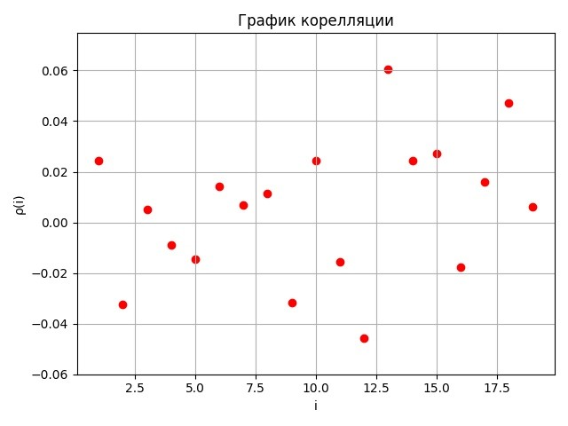

# Лабораторная работа №3. Моделирование непрерывных случайных распределений

## I. Смоделировать непрерывную случайную величину с заданной плотностью распределения вероятности.


```
def f(x):
    if 0 <= x < 2:
        return 0.3 * x
    if x == 2:
        return 0.4
    if 2 < x <= 4:
        return 0.2

a = 0 # левая граница
b = 4 # правая граница
m = 0.6 # максимум функции
```

- Теоретическое мат. ожидание: 2
- Теоретическая дисперсия: 0,9

Сгенерируем n=1000 элементов:
```
def generator(n, xsi=1650755800):
    a = 630360016
    m = 2147483647
    res = []
    for i in range(n):
        res.append(xsi / m)
        xsi = (a * xsi) % m
    return res

def func_method(f, a, b, m, n):
    g = generator(n * 6)
    x = []
    i = 0
    while len(x) < n:
        mu1 = a + g[i] * (b - a)
        mu2 = m * g[i + 1]
        if mu2 <= f(mu1):
            x.append(mu1)
        i += 2
    return x
```

Вывод:
- Оценка мат. ожидания: 1.9906602103964723
- Оценка дисперсии: 0.9148113305433243
- Доверительный интервал мат. ожидания: (1.93138, 2.04994)




## II. Используя метод Бокса-Мюллера, смоделировать нормально распределенную случайную величину X ~ N(2, 2).

```
def box_muller_method_2_2(n):
    n = int(n / 2)
    mu = 2
    sigma = 2 ** 0.5
    g1 = generator(n, 284255903)
    g2 = generator(n, 186734714)
    x = []
    for i in range(n):
        x.append(mu + sigma * (-2 * log2(g1[i])) ** 0.5 * sin(2 * pi * g2[i]))
        x.append(mu + sigma * (-2 * log2(g1[i])) ** 0.5 * cos(2 * pi * g2[i]))
    return x
```

Вывод:
- Оценка мат. ожидания: 2.009508537516103
- Оценка дисперсии: 2.7860955922361352
- Доверительный интервал мат. ожидания: (1.90605, 2.11296)
- x2 расчитанный: 16.495739360523825
- x2 теоретический: 23.684791304840576


