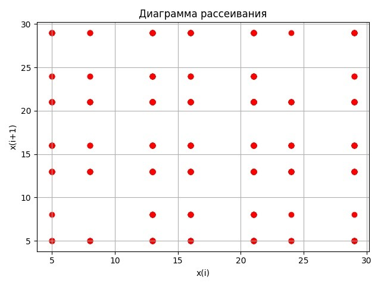

# Лабораторная работа №2. Моделирование дискретных случайных распределений 

## Описание задачи

I. Смоделировать дискретную случайную величину, заданную рядом распределения:

II. Смоделировать закон распределения Пуассона  при lambda = 8 через описанный подход, а также, используя последовательный метод обратных функций.

Для полученных распределений требуется:
- оценить математическое ожидание;
- оценить дисперсию;
- построить доверительный интервал для математического ожидания, соответствующий доверительной вероятности beta = 0.95;
- оценить корреляционную функцию по графикам (j, p(j)) и (Xj, Xj + 1) (при построении графика корреляционной функции ограничиться первыми 20 значениями);
- оценить закон распределения по графику частоты появления значений случайной величины в результате экспериментов.

## Полученные результаты и их анализ

#### I. Последовательный метод обратных функций на заданном ряде распределения

x: [5, 8, 13, 16, 21, 24, 29]

p: [0.1, 0.02, 0.25, 0.15, 0.35, 0.03, 0.1]

Мат. ожидание: 17.28

Дисперсия: 41.5616

Оценка мат. ожидания: 17.236

Оценка дисперсии: 42.45475875875849

Доверительный интервал мат. ожидания: (16.83215, 17.63985)

#### II-I Последовательный метод обратных функций на ряде распределения Пуассона, полученном при lambda = 8

Оценка мат. ожидания: 7.959

Оценка дисперсии: 7.9792982982983025

Доверительный интервал мат. ожидания: (7.78392, 8.13408)

#### II-II Метод Пуассона при lambda = 8

Оценка мат. ожидания: 8.122

Оценка дисперсии: 8.337453453453458

Доверительный интервал мат. ожидания: (7.94303, 8.30097)

