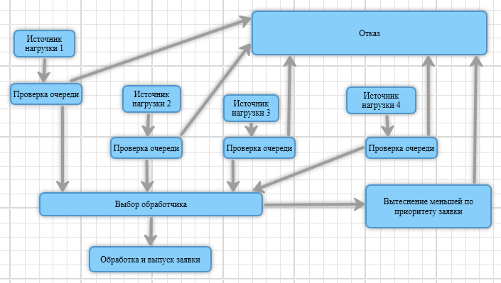

# Лабораторная работа №5. Моделирование в среде GPSS

## Задание
В системе GPSS построить модель системы массового обслуживания с отказами, абсолютным приоритетом. Система включает два канала обслуживания, четыре источника нагрузки. Каждый источник нагрузки имеет свой уникальный приоритет. Размер очереди - 160 требований. Время обслуживания требований распределено равномерно в интервале от 0.15 [с] до 0.65 [с]. Интервал времени между поступлениями требований с наивысшим приоритетом распределен равномерно в интервале от 10 [с] до 35 [с]. Интервалы поступления требований с более низкими приоритетами определяются делением границ интервала поступления требований с наивысшим приоритетом на номер приоритета. 

## Схема



## Программа

```
PRIBOR STORAGE 2; Выделяем 2 канала обслуживания
GENERATE (UNIFORM(1,10,35)),,,,1; Первый источник нагрузки
TEST L Q$QUE,160,OTKAZ; Проверка на переполнение очереди
QUEUE QUE; Увеличиваем очередь
TRANSFER ALL,OPR1,OTKAZ,3; Отправляем заявку на поиск свободного канала обработки
GENERATE ((UNIFORM(1,10,35))/2),,,,2; Второй источник нагрузки
TEST L Q$QUE,160,OTKAZ; Проверка на переполнение очереди
QUEUE QUE; Увеличиваем очередь
TRANSFER ALL,OPR1,OTKAZ,3; Отправляем заявку на поиск свободного канала обработки
GENERATE ((UNIFORM(1,10,35))/3),,,,3; Третий источник нагрузки
TEST L Q$QUE,160,OTKAZ; Проверка на переполнение очереди
QUEUE QUE; Увеличиваем очередь
TRANSFER ALL,OPR1,OTKAZ,3; Отправляем заявку на поиск свободного канала обработки
GENERATE ((UNIFORM(1,10,35))/4),,,,4; Четвертый источник нагрузки
TEST L Q$QUE,160,OTKAZ; Проверка на переполнение очереди
QUEUE QUE; Увеличиваем очередь
TRANSFER ALL,OPR1,OTKAZ,3; Отправляем заявку на поиск свободного канала обработки
OPR1 PREEMPT OP1,PR,CHECK,,RE; Проверка приоритета, помещение в очередь или удаление
ASSIGN 1,OP1; Отдаем заявку первому каналу
TRANSFER ,COME; Переход к блоку COME
OPR2 PREEMPT OP2,PR,CHECK,,RE; Проверка приоритета, помещение в очередь или удаление
ASSIGN 1,OP2; Отдаем заявку второму каналу
TRANSFER ,COME; Переход к блоку COME
OTKAZ TERMINATE 1; Отказываем заявке, если все обработчики заняты
COME DEPART QUE; Уменьшаем очередь, собираем статистику
ADVANCE (UNIFORM(2,0.15,0.65)); Задержка заявки
RETURN P1; Заявка освобождает устройство
TERMINATE 1; Удаляем заявку
CHECK TEST L Q$QUE,160,OTKAZ; Проверка на переполнение очереди
QUEUE QUE; Увеличиваем очередь
TERMINATE 1; Удаляем заявку
START 1000000; Устанавливаем счетчик завершения 
```

## Отчет

```
FACILITY         ENTRIES  UTIL.   AVE. TIME AVAIL. OWNER PEND INTER RETRY DELAY
 OP1               2404    0.000       0.382  1        0    0    0     0      0
 OP2                165    0.000       0.388  1        0    0    0     0      0


QUEUE              MAX CONT. ENTRY ENTRY(0) AVE.CONT. AVE.TIME   AVE.(-0) RETRY
 QUE               160  160   2729   2569   159.796 131713.740 2246542.477   0


STORAGE            CAP. REM. MIN. MAX.  ENTRIES AVL.  AVE.C. UTIL. RETRY DELAY
 PRIBOR              2    2   0     0        0   1    0.000  0.000    0    0
```