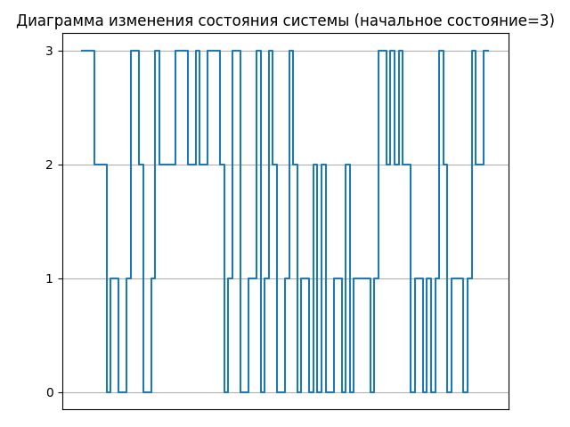

# Лабораторная работа №4. Моделирование марковских процессов

## Задание
Разработайте программу экспериментальных исследований дискретной цепи Маркова с матрицей переходных вероятностей:


Осуществите прогоны модели с начальными значениями, соответствующими состояниям цепи. Выведите на экран диаграммы изменения состояния системы, а также информацию о классах эквивалентных состояний системы, возвратных, нулевых и периодических состояниях, стационарное распределение вероятностей марковской цепи.

## Решение

Сгенерируем числа для подачи на цепь маркова с помощью функции generator, принимающей на вход количество получаемых значений.

```
def generator(n):
    a = 630360016
    m = 2147483647
    xsi = 1650755800
    res = []
    for i in range(n):
        res.append(round(xsi / m, 3))
        xsi = (a * xsi) % m
    return res 
```

Функция get_state принимает на вход строку матрицы переходных вероятностей и значение, поступающее на вход марковской цепи. На выходе имеем номер следующего состояния.

```
def get_state(row, value):
    amount = 0
    for i in range(len(row)):
        if value > amount + row[i]:
            amount += row[i]
        else:
            return i
```

Функция get_states принимает на вход матрицу переходных вероятностей, начальное состояние и список значений, поступающих на вход марковской цепи. На выходе получаем список всех состояний в соответствии с подаваемыми на вход значениями. Так же функция рисует диаграмму изменения состояния системы.

```
def get_states(g, start_state, values):
    cur_state = start_state
    states = []
    for value in values:
        cur_state = get_state(g[cur_state], value)
        states.append(cur_state)
    plt.title("Диаграмма изменения состояния системы (начальное состояние=" + str(start_state) + ")")
    plt.grid()
    t = [i for i in range(len(values) + 1)]
    plt.step(t, [start_state] + states, where='post')
    t = []
    plt.xticks(t)
    plt.yticks(range(len(g)))
    plt.show()
    return states
```

Результаты прогона модели с начальными значениями, соответствующими состояниям цепи для 20 значений:


Диаграммы изменения состояний для 100 значений:




Диаграмма вероятностей пребывания в состояниях на 1000 входных значениях при всех начальных состояниях получена практически идентичная.


Значения найдены как количество раз пребывания в соответствующем состоянии к числу всех переходов.

## Анализ

По матрице переходных вероятностей построим граф.


Все состояния цепи образуют один неразложимый класс, так как граф является связным. Можно достичь любого состояния из любого другого состояния. Следовательно, классы эквивалентных состояний отсутствуют.

Все состояния цепи возвратные, так как после ухода из состояния можно в будущем вернуться в него с вероятностью 1.

Из диаграммы изменения состояния системы можно заметить, что нет периодических состояний, то есть состояний, в которые система попадает за определенное количество шагов.

Стационарное распределение уже было получено на шаге построения диаграммы вероятности пребывания в состояниях. Эти значения получены экспериментальным путем и близки к теоретическим значениям, которые можно рассчитать, как минимум, двумя способами. Рассмотрим оба.

1.	Возведем матрицу переходных вероятностей в большую степень. Например, в сотую. Каждая строка такой матрицы будет иметь одинаковые значения. Это и будет стационарным распределением. Результат: [0.22058824 0.22058824 0.32352941 0.23529412]
2.	Решим аналитически уравнение p = p*G, где p = | p0 p1 p2 p3 | с условием, что p0+p1+p2+p3=1. Воспользовавшись методом Гаусса, находим: p0 = 15/68 = 0,22; p1 = 15/68 = 0,22; p2 = 33/102 = 0,32; p3 = 12/51 = 0,24.


Из стационарного распределения также можно сделать вывод, что система не имеет нулевых состояний, так как в нем нет нулевых значений.

