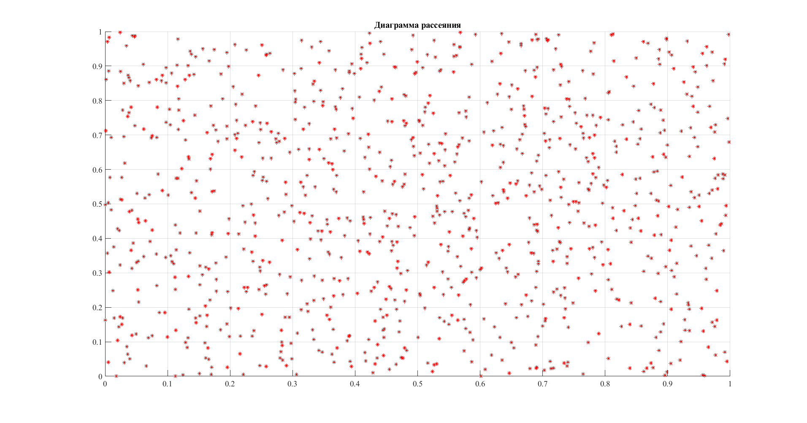
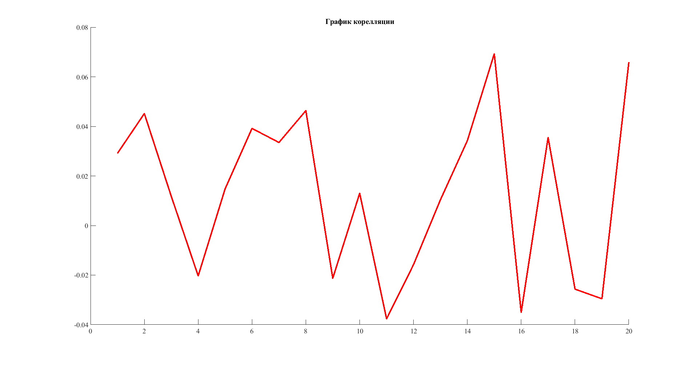
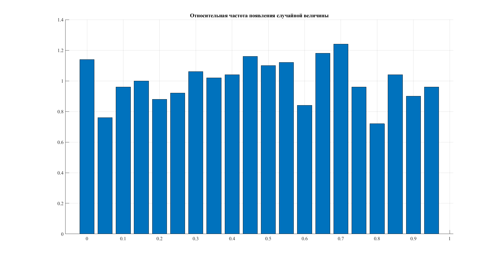

# Лабораторная работа №1. Генератор псевдослучайной последовательности

## Описание задачи
Используя метод вычетов, сгенерировать последовательность из 1000 псевдослучайных чисел.

## Решение
```
function [randomArray] = generator(n)
    randomArray = zeros(1, n);
    a = 630360016;
    m = 2147483647;
    xsi = 1148216685;
    for i = 1:n
        randomArray(i) = xsi / m;
        xsi = mod(a * xsi, m);
    end
end
```

## Анализ результатов
```
function [Mx] = expectedValue(arr)
    Mx = sum(arr) / size(arr, 2);
end
```
```
>> expectedValue(generator(1000))
ans =
    0.5004
```
##### Оценить математическое ожидание полученной последовательности.
```
function [Dx] = variance(arr)
    sum = 0;
    n = size(arr, 2);
    Mx = expectedValue(arr);
    for i = 1:n
        sum = sum + (arr(i) - Mx) ^ 2;
    end
    Dx = sum / (n - 1);
end
```
```
>> variance(generator(1000))
ans =
    0.0801
```
##### Оценить дисперсию полученной последовательности.

Диаграмма рассеивания
```
function [] = scatterPlot(arr)
    set(0,'DefaultAxesFontSize',14,'DefaultAxesFontName','Times New Roman');
    set(0,'DefaultTextFontSize',14,'DefaultTextFontName','Times New Roman'); 
    figure('Units', 'normalized', 'OuterPosition', [0 0 1 1]);
    title('Диаграмма рассеяния');
    hold on;
    for i = 1:size(arr, 2) - 1
        plot(arr(i), arr(i + 1),'r*');
    end
    grid on;
end
```
```
>> scatterPlot(generator(1000))
```


График корреляции
```
function [Kj] = covariance(arr, j)
    n = size(arr, 2);
    Mx = expectedValue(arr);
    sum = 0;
    for i = 1:n - j
        sum = sum + (arr(i) - Mx) * (arr(i + j) - Mx);
    end
    Kj = sum / (n - j);
end  

function [] = correlation(arr, a, b)
    Dx = variance(arr);
    j = a:b;
    cor = zeros(size(j));
    cnt = 1;
    for i = j
        cor(cnt) = covariance(arr, i) / Dx;
        cnt = cnt + 1;
    end
    set(0,'DefaultAxesFontSize',14,'DefaultAxesFontName','Times New Roman');
    set(0,'DefaultTextFontSize',14,'DefaultTextFontName','Times New Roman'); 
    figure('Units', 'normalized', 'OuterPosition', [0 0 1 1]);
    title('График корелляции');
    hold on;
    plot(j,cor,'r','LineWidth',3);
end
```
```
>> correlation(generator(1000), 1, 20)
```


##### Оценить корреляционную функцию полученной последовательности по графикам (j, p(j)) и (Xj, Xj + 1). При построении первого графика ограничиться первыми 20 значениями, второй график строится для всего множества сгенерированных значений.

```
function [Kj] = covariance(arr, j)
    n = size(arr, 2);
    Mx = expectedValue(arr);
    sum = 0;
    for i = 1:n - j
        sum = sum + (arr(i) - Mx) * (arr(i + j) - Mx);
    end
    Kj = sum / (n - j);
end  

function [] = correlation(arr, a, b)
    Dx = variance(arr);
    j = a:b;
    cor = zeros(size(j));
    cnt = 1;
    for i = j
        cor(cnt) = covariance(arr, i) / Dx;
        cnt = cnt + 1;
    end
    set(0,'DefaultAxesFontSize',14,'DefaultAxesFontName','Times New Roman');
    set(0,'DefaultTextFontSize',14,'DefaultTextFontName','Times New Roman'); 
    figure('Units', 'normalized', 'OuterPosition', [0 0 1 1]);
    title('График корелляции');
    hold on;
    plot(j,cor,'r','LineWidth',3);
end
```
```
>> correlation(generator(1000), 1, 20)
```


##### Используя метод гистограмм, проверить гипотезу о законе распределения.

```
function [] = frequency(k, arr)
    set(0,'DefaultAxesFontSize',14,'DefaultAxesFontName','Times New Roman');
    set(0,'DefaultTextFontSize',14,'DefaultTextFontName','Times New Roman'); 
    figure('Units', 'normalized', 'OuterPosition', [0 0 1 1]);
    title('Относительная частота появления случайной величины');
    hold on;
    detX = 1 / k;
    N = hist(arr, k);
    N = N / (size(arr, 2) * detX);
    x = 0:1/k:1-1/k;
    bar(x, N);
    grid on;
end
```
```
>> frequency(20, generator(1000))
```
